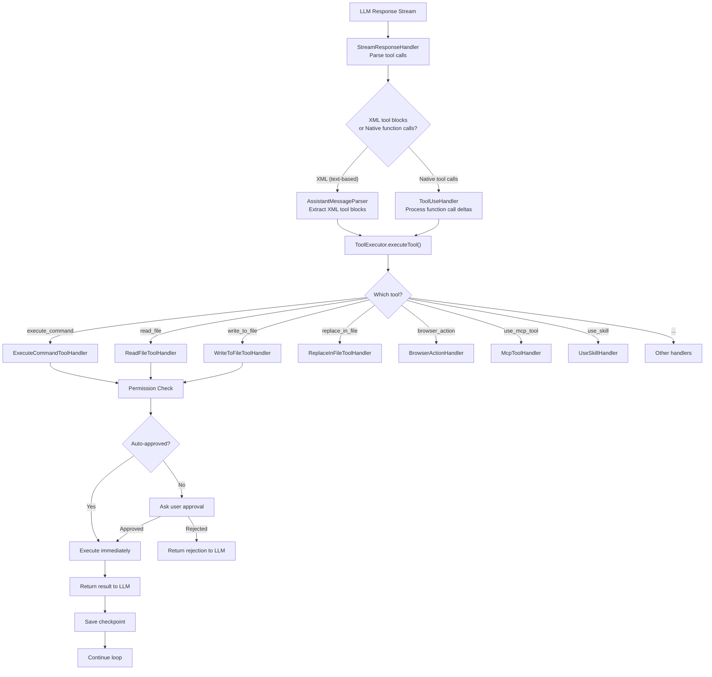
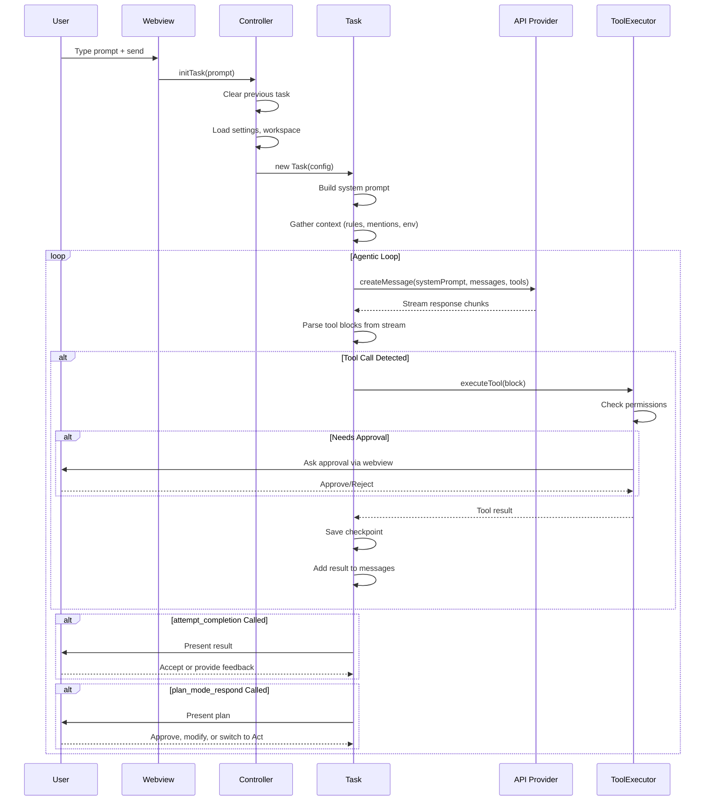
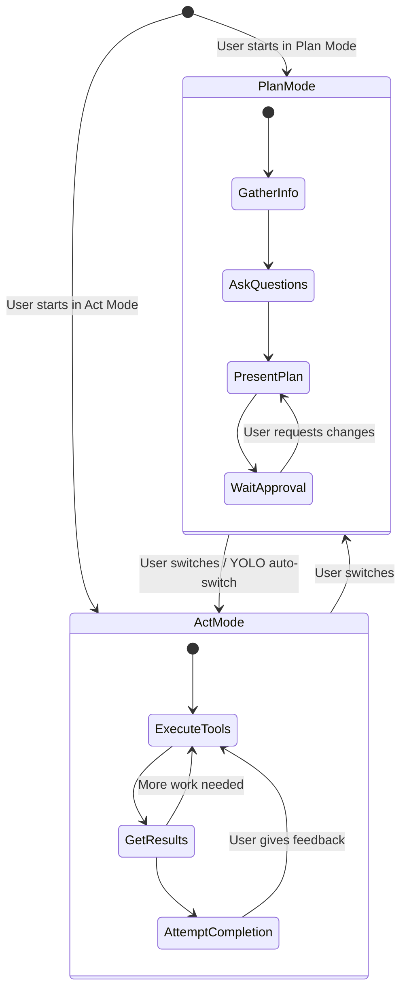
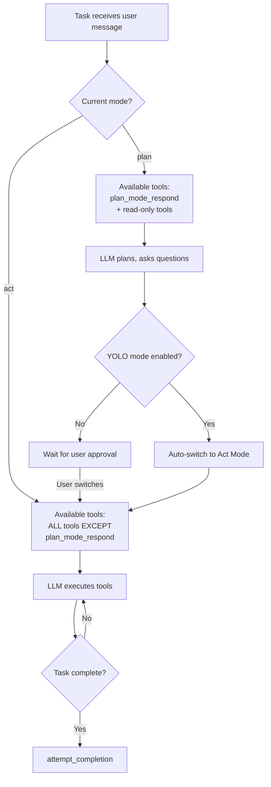
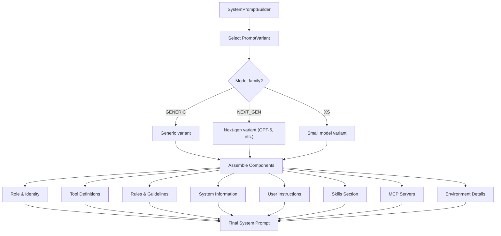
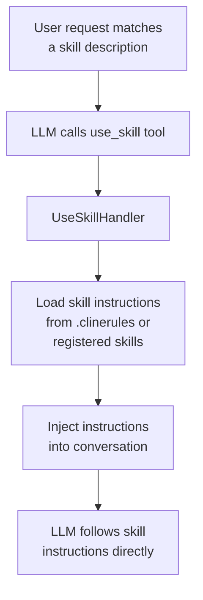

 Tool System — Complete Reference

### All Built-in Tools

Defined in `src/shared/tools.ts` as `ClineDefaultTool` enum:

| Tool ID | Enum Name | Description | Read-Only? |
|---|---|---|---|
| `execute_command` | `BASH` | Execute shell commands | ❌ |
| `read_file` | `FILE_READ` | Read file contents | ✅ |
| `write_to_file` | `FILE_NEW` | Create/overwrite files | ❌ |
| `replace_in_file` | `FILE_EDIT` | Search/replace in files | ❌ |
| `apply_patch` | `APPLY_PATCH` | Apply unified diff patches | ❌ |
| `search_files` | `SEARCH` | Search files via ripgrep | ✅ |
| `list_files` | `LIST_FILES` | List directory contents | ✅ |
| `list_code_definition_names` | `LIST_CODE_DEF` | List code definitions (tree-sitter) | ✅ |
| `browser_action` | `BROWSER` | Headless browser actions | ✅ |
| `ask_followup_question` | `ASK` | Ask user a question | ✅ |
| `attempt_completion` | `ATTEMPT` | Mark task as complete | — |
| `plan_mode_respond` | `PLAN_MODE` | Respond in plan mode | — |
| `act_mode_respond` | `ACT_MODE` | Respond in act mode | — |
| `use_mcp_tool` | `MCP_USE` | Call an MCP tool | ❌ |
| `access_mcp_resource` | `MCP_ACCESS` | Access an MCP resource | ✅ |
| `load_mcp_documentation` | `MCP_DOCS` | Load MCP server docs | ✅ |
| `new_task` | `NEW_TASK` | Spawn a new sub-task | ❌ |
| `focus_chain` | `TODO` | Create/manage focus chain (TODO) | ❌ |
| `web_fetch` | `WEB_FETCH` | Fetch URL content | ✅ |
| `web_search` | `WEB_SEARCH` | Web search | ✅ |
| `condense` | `CONDENSE` | Condense conversation context | — |
| `summarize_task` | `SUMMARIZE_TASK` | Summarize task for handoff | — |
| `report_bug` | `REPORT_BUG` | Report a bug | ❌ |
| `new_rule` | `NEW_RULE` | Create a new .clinerules rule | ❌ |
| `generate_explanation` | `GENERATE_EXPLANATION` | Generate code explanation | ✅ |
| `use_skill` | `USE_SKILL` | Activate a skill by name | ✅ |
| `use_subagents` | `USE_SUBAGENTS` | Delegate to sub-agents | ✅ |

### Tool Execution Flow



### Tool Call Formats

Cline supports **two** tool call formats depending on the API provider:

**1. XML-based (text in response):**
```xml
<execute_command>
  <command>npm run test</command>
  <requires_approval>false</requires_approval>
</execute_command>
```

**2. Native function calls (OpenAI/Anthropic tool_use):**
```json
{
  "type": "function",
  "function": {
    "name": "execute_command",
    "arguments": "{\"command\": \"npm run test\"}"
  }
}
```

The `StreamResponseHandler` and `ToolCallProcessor` handle both formats transparently.

---

## 7. Task Execution Pipeline — End to End



### The Recursive API Loop

The core loop in `Task` follows this pattern:

1. **Build context** — system prompt + conversation history + environment details
2. **Call API** — stream the response from the selected LLM provider
3. **Parse response** — extract text + tool calls (XML or native)
4. **Execute tools** — with permission checks, run each tool
5. **Collect results** — format tool results as user messages
6. **Loop** — send results back to the LLM, repeat until `attempt_completion` or user interruption

---

## 8. Plan Mode vs Act Mode

Cline implements a **dual-mode system** that separates planning from execution:



### Mode Conditional Routing



### Mode-Specific Model Support

Users can configure **different models** for each mode:

| Setting | Purpose |
|---|---|
| `planModeApiProvider` | Provider used during Plan mode |
| `actModeApiProvider` | Provider used during Act mode |
| `planActSeparateModelsSetting` | Enable/disable separate models |

When switching modes, `buildApiHandler()` is called with the new mode, creating a fresh handler for the mode's provider.

---

## 9. Prompt Architecture & System Prompt Generation

### Modular Component System

The system prompt is built from **composable components** in `src/core/prompts/system-prompt/`:



### Tool Spec Generation

Each tool has **variant-specific specifications** in `src/core/prompts/system-prompt/tools/`:

```typescript
// Example: use_skill.ts
const generic: ClineToolSpec = {
  id: ClineDefaultTool.USE_SKILL,
  variant: ModelFamily.GENERIC,
  name: "use_skill",
  description: "Load and activate a skill by name...",
  contextRequirements: (context) => 
    context.skills !== undefined && context.skills.length > 0,
  parameters: [{
    name: "skill_name",
    required: true,
    instruction: "The name of the skill to activate..."
  }]
}
```

Tools are **conditionally included** based on:
- `contextRequirements` — dynamic checks (e.g., skills exist?)
- Current mode (plan vs act)
- Provider capabilities (native tool calls vs XML)
- Feature flags (web tools enabled, subagents enabled, etc.)

### Variant System

The prompt system supports multiple **model family variants** with a builder pattern:

```typescript
interface VariantFactory {
  create(family: ModelFamily): VariantBuilder
  createGeneric(): VariantBuilder
  createNextGen(): VariantBuilder
  createXs(): VariantBuilder
}
```

Each variant can:
- Override component templates
- Include/exclude tools
- Set model-specific parameters
- Use custom placeholders

---

## 10. Skills System

Skills are **reusable instruction packages** that the LLM can activate at runtime:



### Skills Section in System Prompt

```
SKILLS

Available skills:
  - "deploy": Deploy the application to production
  - "refactor": Refactor code following SOLID principles

To use a skill:
1. Match the user's request to a skill
2. Call use_skill with the skill_name
3. Follow the returned instructions
```

---
